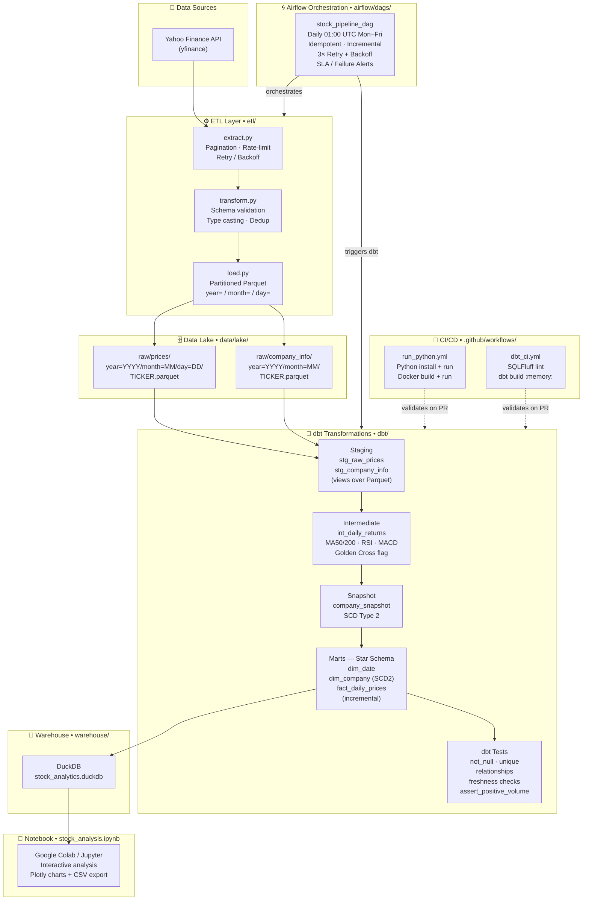
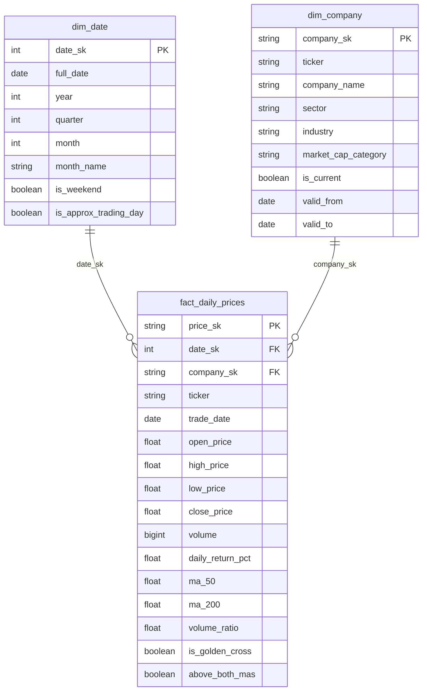

# 📈 stock-analysis-v1

Production-grade **U.S. Equity Analytics Platform** — a fully orchestrated data pipeline that extracts stock data from Yahoo Finance, lands it as partitioned Parquet in a local data lake, transforms it into an analytics-ready star schema with **Apache Airflow + dbt + DuckDB**, and exposes interactive analysis via a **Jupyter / Google Colab** notebook.

> ⚠️ **Not financial advice.** For research and educational purposes only.

---

## 🗺️ Architecture Overview



---

## 🏗️ Project Structure

```
stock-analysis-v1/
├── analysis.py                    # Standalone terminal stock screener
├── stock_analysis.ipynb           # Interactive Jupyter / Google Colab notebook
│
├── etl/                           # Python ETL modules
│   ├── extract.py                 #   API extraction (pagination + rate-limit + retry)
│   ├── transform.py               #   Data cleaning & validation
│   └── load.py                    #   Hive-partitioned Parquet writer
│
├── airflow/
│   └── dags/
│       ├── stock_pipeline_dag.py  #   Main daily pipeline DAG
│       └── utils/callbacks.py     #   Failure & SLA alert hooks
│
├── dbt/
│   ├── models/
│   │   ├── staging/               #   stg_raw_prices, stg_company_info
│   │   ├── intermediate/          #   int_daily_returns (returns, MAs, flags)
│   │   └── marts/                 #   dim_date, dim_company (SCD2), fact_daily_prices
│   ├── snapshots/                 #   company_snapshot (SCD Type 2)
│   ├── tests/                     #   assert_positive_volume (singular test)
│   ├── macros/                    #   generate_schema_name
│   ├── dbt_project.yml
│   ├── profiles.yml               #   DuckDB targets: dev / staging / prod
│   └── packages.yml               #   dbt-utils
│
├── data/lake/                     # Parquet data lake (gitignored)
│   └── raw/prices/ & company_info/
├── warehouse/                     # DuckDB database file (gitignored)
│
├── Dockerfile                     # apache/airflow:2.9.3 + dbt + extras
├── docker-compose.yml             # postgres + airflow-init + webserver + scheduler
├── requirements.txt               # Stock analysis dependencies
├── requirements-airflow.txt       # Airflow + dbt + DuckDB extras
├── .env.example                   # ← copy to .env and fill in secrets
│
└── .github/workflows/
    ├── run_python.yml             # CI: Python run + Docker build
    └── dbt_ci.yml                 # CI: SQLFluff lint + dbt build on PR
```

---

## 🔑 API Keys & Secrets You Must Provide

Copy `.env.example` to `.env` and fill in the values marked below.

| Variable | Required | Where to get it |
|---|---|---|
| `AIRFLOW_FERNET_KEY` | ✅ Yes | Run: `python -c "from cryptography.fernet import Fernet; print(Fernet.generate_key().decode())"` |
| `AIRFLOW_SECRET_KEY` | ✅ Yes | Any random string (32+ chars) |
| `AIRFLOW_ADMIN_PASSWORD` | ✅ Yes | Your chosen Airflow UI password |
| `STOCK_API_KEY` | ⬜ Optional | Reserved for future premium API |
| `ALPHA_VANTAGE_API_KEY` | ⬜ Optional | [alphavantage.co](https://www.alphavantage.co/support/#api-key) — free tier |
| `POLYGON_API_KEY` | ⬜ Optional | [polygon.io](https://polygon.io) — free tier |
| `SLACK_WEBHOOK_URL` | ⬜ Optional | [Slack Incoming Webhooks](https://api.slack.com/messaging/webhooks) — for failure alerts |

> **Note:** The pipeline uses **Yahoo Finance via `yfinance`** (no API key needed) by default.  
> Alpha Vantage and Polygon keys are placeholders for future data-source upgrades.

---

## 🚀 Quick Start — Run Everything with Docker

### Prerequisites
- Docker Desktop (or Docker Engine + Compose plugin)
- Git

### Step 1 — Clone & configure

```bash
git clone https://github.com/nazimsanusi-dev/stock-analysis-v1.git
cd stock-analysis-v1

# Copy the env template
cp .env.example .env
```

Open `.env` and set the required values (see table above), then:

```bash
# Linux / macOS: add your user ID so Airflow files aren't created as root
echo "AIRFLOW_UID=$(id -u)" >> .env
```

### Step 2 — Generate the Fernet key

```bash
python -c "from cryptography.fernet import Fernet; print(Fernet.generate_key().decode())"
# → paste output as AIRFLOW_FERNET_KEY in .env
```

### Step 3 — Initialise Airflow (first time only)

```bash
docker compose up airflow-init
# Wait for: "✔ Airflow initialised" then Ctrl+C
```

### Step 4 — Start the full stack

```bash
docker compose up --build -d
```

| Service | URL / Port |
|---|---|
| Airflow UI | http://localhost:8080 (admin / *your password*) |
| PostgreSQL | localhost:5432 |

### Step 5 — Trigger the pipeline

1. Open **http://localhost:8080**
2. Enable the `stock_pipeline` DAG (toggle on)
3. Click **▶ Trigger DAG** to run immediately, or wait for the daily 01:00 UTC schedule
4. Watch tasks execute: `check_new_data → extract_prices & extract_companies → dbt staging → intermediate → snapshots → marts → test → docs`

### Step 6 — Stop

```bash
docker compose down          # stop containers (keep volumes)
docker compose down -v       # stop + delete all data volumes
```

---

## 🐍 Quick Start — Run Standalone Screener (No Docker)

For a fast single-run analysis without Airflow:

```bash
# Install dependencies
pip install -r requirements.txt

# Optional: copy .env for configuration
cp .env.example .env   # edit SCREENER_TICKERS etc.

# Run the terminal screener
python analysis.py
```

Results are saved to `results/analysis_YYYYMMDD_HHMMSS.csv`.

---

## 📓 Google Colab / Jupyter Notebook

Open the interactive notebook in one click:

[](https://colab.research.google.com/github/nazimsanusi-dev/stock-analysis-v1/blob/main/stock_analysis.ipynb)

Or locally:

```bash
pip install -r requirements.txt jupyter
jupyter notebook stock_analysis.ipynb
```

The notebook covers:
- 📦 Silent dependency install
- ⚙️ Config via Colab Secrets or `.env`
- 📊 Screener results table (colour-coded bullish score)
- 🕯️ Interactive Plotly candlestick + RSI chart
- 🔥 Heatmap: bull score bar chart + RSI vs 1M-return scatter
- 🏢 Fundamentals deep-dive (P/E, EPS, margins, ROE)
- 💾 CSV export + auto-download in Colab

---

## 🔷 dbt — Run Transformations Manually

```bash
cd dbt

# Install dbt packages
dbt deps --profiles-dir .

# Run all models
dbt run --profiles-dir . --target dev

# Run specific layer
dbt run --select staging     --profiles-dir . --target dev
dbt run --select intermediate --profiles-dir . --target dev
dbt snapshot --profiles-dir . --target dev   # SCD Type 2
dbt run --select marts       --profiles-dir . --target dev

# Run all tests
dbt test --profiles-dir . --target dev

# Generate & serve docs (lineage graph)
dbt docs generate --profiles-dir . --target dev
dbt docs serve --port 8081
```

---

## 🤖 CI/CD Pipeline

Every Pull Request touching `dbt/**` or `etl/**` automatically runs:

```
PR opened / updated
      │
      ▼
┌─────────────────┐        ┌──────────────────────────────┐
│ SQLFluff Lint   │──pass──▶  dbt build --target staging  │
│ (DuckDB dialect)│        │  (in-memory DuckDB, fixtures) │
└─────────────────┘        └──────────────────────────────┘
```

Push to `main` also runs:
- `run_python.yml` — installs deps, runs `analysis.py`, builds Docker image, runs container

---

## 📊 Data Model — Star Schema



---

## 🛠️ Tech Stack

| Layer | Technology |
|---|---|
| **Language** | Python 3.12 |
| **Orchestration** | Apache Airflow 2.9.3 (LocalExecutor) |
| **Transformation** | dbt-core 1.8 + dbt-duckdb |
| **Warehouse** | DuckDB 0.10 (embedded, file-based) |
| **Data Lake** | Hive-partitioned Parquet (pyarrow) |
| **API / Data Source** | Yahoo Finance via yfinance |
| **Retry Logic** | tenacity (exponential backoff) |
| **Containerisation** | Docker + Docker Compose |
| **CI/CD** | GitHub Actions |
| **SQL Linting** | SQLFluff (DuckDB dialect) |
| **Notebook** | Jupyter / Google Colab |
| **Visualisation** | Plotly + Matplotlib + Seaborn |

---

## 📁 Key Environment Variables

| Variable | Default | Description |
|---|---|---|
| `SCREENER_TICKERS` | `AAPL,MSFT,...` | Comma-separated ticker list |
| `SCREENER_PERIOD` | `1y` | yfinance history period |
| `DATA_LAKE_PATH` | `/opt/airflow/data/lake` | Root of the Parquet lake |
| `WAREHOUSE_PATH` | `/opt/airflow/warehouse/stock_analytics.duckdb` | DuckDB file path |
| `DBT_TARGET` | `prod` | dbt profile target (`dev`/`staging`/`prod`) |
| `ATH_LOOKBACK_DAYS` | `252` | Trading days to look back for ATH |
| `RSI_PERIOD` | `14` | RSI calculation window |

---

*Built with ❤️ for U.S. equity research.*

